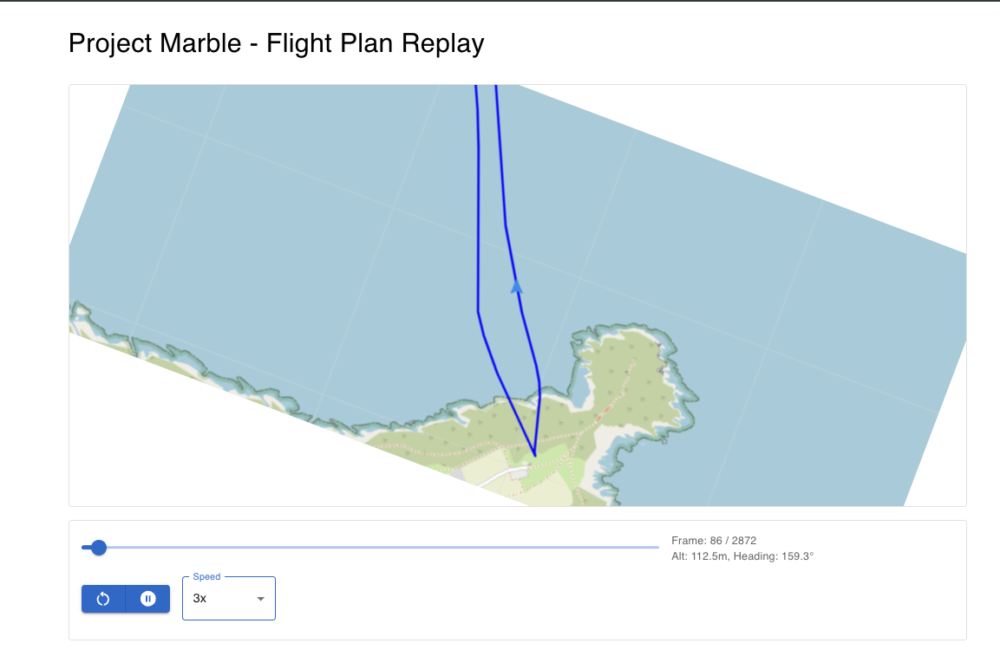

# Project Marble - Flight Plan Replay

## Overview

Project Marble is a flight data visualization tool that allows users to upload telemetry log (`.tlog`) files and replay flight paths on an interactive map. The project consists of a **FastAPI** backend and a **React (Next.js) frontend** using **Leaflet** for mapping. It provides a full-stack solution for processing flight data and displaying aircraft movement with heading orientation.

## Tech Stack & Libraries Used

### **Backend (FastAPI)**

- **FastAPI**: The web framework used for building the REST API.
- **pymavlink**: A library used to parse telemetry log (`.tlog`) files and extract flight data.
- **SQLAlchemy**: ORM for handling database interactions.
- **SQLite**: The database for storing flight data.
- **CORS Middleware**: Allows cross-origin requests between the backend and frontend.

### **Frontend (React & Leaflet)**

- **React**: The JavaScript framework used for building the UI.
- **Leaflet**: A lightweight mapping library used to visualize the flight path.
- **MUI (Material UI)**: Provides modern UI components like buttons, sliders, and cards.
- **Axios**: Handles API requests to fetch flight data from the backend.
- **SVG & Leaflet Markers**: Custom aircraft icons and map markers for a better UI representation.

## Features

- Upload `.tlog` files to extract flight path data.
- Store flight data in a database for future retrieval.
- Visualize flight paths using **Leaflet.js** with aircraft movement and heading rotation.
- Play, pause, restart, and control the speed of the flight replay.
- Slider-based navigation through the recorded flight data.

---

## Setup Instructions

### **Backend Setup** (FastAPI)

#### 1. **Clone the repository**

```sh
git clone https://github.com/isaacoduh/project-marble.git
cd project-marble/backend
```

#### 2. **Create a virtual environment**

```sh
python -m venv venv
source venv/bin/activate
```

#### 3. **Install dependencies**

```sh
pip install -r requirements.txt
```

#### 4. **Run the FastAPI server**

```sh
uvicorn main:app --reload
```

- API will be available at: `http://localhost:8000`
- Open `http://localhost:8000/docs` to view API documentation (Swagger UI).

---

## **Frontend Setup** (React + Leaflet)

#### 1. **Navigate to the frontend directory**

```sh
cd ../frontend
```

#### 2. **Install dependencies**

```sh
npm install
```

#### 3. **Run the development server**

```sh
npm run dev
```

- The frontend will be available at: `http://localhost:3000`

---

## Usage

1. Start the **backend** (`FastAPI`) and the **frontend** (`React` + `Leaflet`).
2. Upload a `.tlog` file via the API or UI.
3. View the flight path on the interactive map.
4. Use the play, pause, restart, and speed controls to replay the flight.

## API Endpoints

| Method | Endpoint                             | Description                                   |
| ------ | ------------------------------------ | --------------------------------------------- |
| POST   | `/upload-tlog/`                      | Upload a `.tlog` file and extract flight data |
| GET    | `/flight-data/?file_name=<filename>` | Retrieve stored flight data                   |


